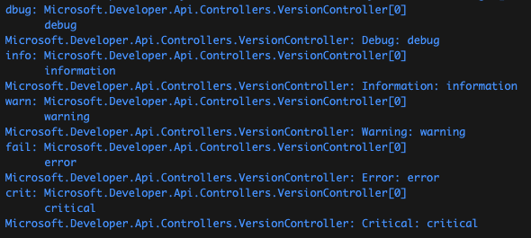
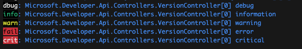

# vscode-tips

Useful tips & tricks for Visual Studio Code. Mostly for me, but public so others might enjoy.

> [!Warning]
> I'm on a mac, results may vary

## .NET Logging

In vs code, [debug provider][dotnet-logging-debug-provider] and the [console provider][dotnet-logging-console-provider] both log to the [debug console][vscode-debug-console]. This ends up duplicating all the logs, in different formats, which makes it difficult to read and understand. To make things worse they're not [in color](/dotnet/logging.md#add-some-color) :roll_eyes:.

I've spent way too much time figuring out how to go from this:



To this:



If you're interested in doing the same (or something in between), check out [`/dotnet/logging.md`](/dotnet/logging.md)

### Other settings

I've found that a couple more settings will reduce the noise in your logs when developing locally:

```json
//settings.json
{
  "csharp.debug.logging.moduleLoad": false,
  "csharp.debug.logging.exceptions": false
}
```

## Settings

I'm not trying to tell you how to live your life. But here are some settings that I've found make life more delightful _(and more importantly, get the stuff that I don't care about, out of my way)_.

### Explorer settings

Here are some **Explorer** settings that I find useful for .NET:

```json
// settings.json
{
  "explorer.fileNesting.enabled": true,
  "explorer.fileNesting.expand": false,
  "explorer.fileNesting.patterns": {
    // global
    "README.md": ".gitignore, .gitattributes, LICENSE, SECURITY.md, SUPPORT.md, CODE_OF_CONDUCT.md",
    "dockerfile": ".dockerignore",
    // ts, js
    ".env": ".env.development, .env.production",
    "*.tsx": "${capture}.ts, ${capture}.test.tsx, ${capture}.css",
    ".*rc.yml": ".${capture}ignore",
    ".*rc.js": ".${capture}ignore",
    // .net
    "*.cs": "I${capture}.cs,",
    "*.csproj": "appsettings.json, dockerfile, host.json, local.settings.json, .gitignore",
    "appsettings.json": "appsettings.development.json, appsettings.production.json"
  }
}
```

_The new C# DevKit has a pretty nice Explorer, but since I bounce around to different programming languages (and I've taken the time to set up vscode's Explorer just the way I like it), I tend to use vscode's Explorer._

### Files settings

```json
// settings.json
{
  "files.associations": {
    // see-ya squigglies
    "appsettings.*.json": "jsonc",
    "local.settings.json": "jsonc",
    "launchSettings.json": "jsonc"
  },
  "files.exclude": {
    "**/.vs": true,
    "**/bin": true,
    "**/obj": true,
    "**/.git": true,
    "**/.DS_Store": true,
    "**/__pycache__": true,
    "**/**.dist-info": true,
    "**/node_modules": true
  }
}
```

### Editor settings

I've found that all of the tool trying to help me type my next line of code, end up competing and creating a poor experience. The editor settings below are just a subset of my editor settings, but these are the settings that I've found make my active coding experience most efficient (i.e. I can intuitively accept suggestions from intellicode or copilot):

```json
{
  "editor.emptySelectionClipboard": false, // why the hell is this even a thing
  "editor.acceptSuggestionOnCommitCharacter": false,
  "editor.inlineSuggest.enabled": true,
  "editor.parameterHints.cycle": true,
  "editor.suggest.localityBonus": true,
  "editor.suggest.preview": true,
  "editor.suggest.matchOnWordStartOnly": false,
  "editor.suggest.showStatusBar": true,
  "editor.suggestSelection": "first",
  "editor.snippetSuggestions": "bottom",
  "editor.tabCompletion": "on",

  "github.copilot.editor.enableAutoCompletions": true,

  "editor.minimap.autohide": true,
  "editor.minimap.enabled": false, // I tend to toggle this
  "editor.minimap.showSlider": "always"
}
```

#### Rulers

I write a lot of code that ends up on GitHub (prototypes, samples, customer co-development, etc.).
As such, depending on th project, it is important that the code I produce is written with readability in mind.
You may say that the same is true for all code, which is fair, but in my case specifically, readability on GitHub.com is a top priority.

```sh
I write a lot of code that ends up on GitHub (prototypes, samples, customer co-development, etc.).
As such, depending on th project, it is important that the code I produce is written with readability in mind.
You may say that the same is true for all code, which is fair, but in my case specifically, readability on GitHub.com is a top priority.
```

```json
// settings.json
{
  "editor.rulers": [
    { "column": 99, "color": "#2e2e2e" },
    { "column": 112, "color": "#2e2e2e" },
    { "column": 117, "color": "#2e2e2e" },
    { "column": 139, "color": "#2e2e2e" },
    { "column": 177, "color": "#2e2e2e" },
    { "column": 250, "color": "#2e2e2e" }
  ]
}
```

[dotnet-logging-console-provider]: https://learn.microsoft.com/aspnet/core/fundamentals/logging/#console
[dotnet-logging-debug-provider]: https://learn.microsoft.com/aspnet/core/fundamentals/logging/#debug
[vscode-debug-console]: https://code.visualstudio.com/docs/editor/debugging
